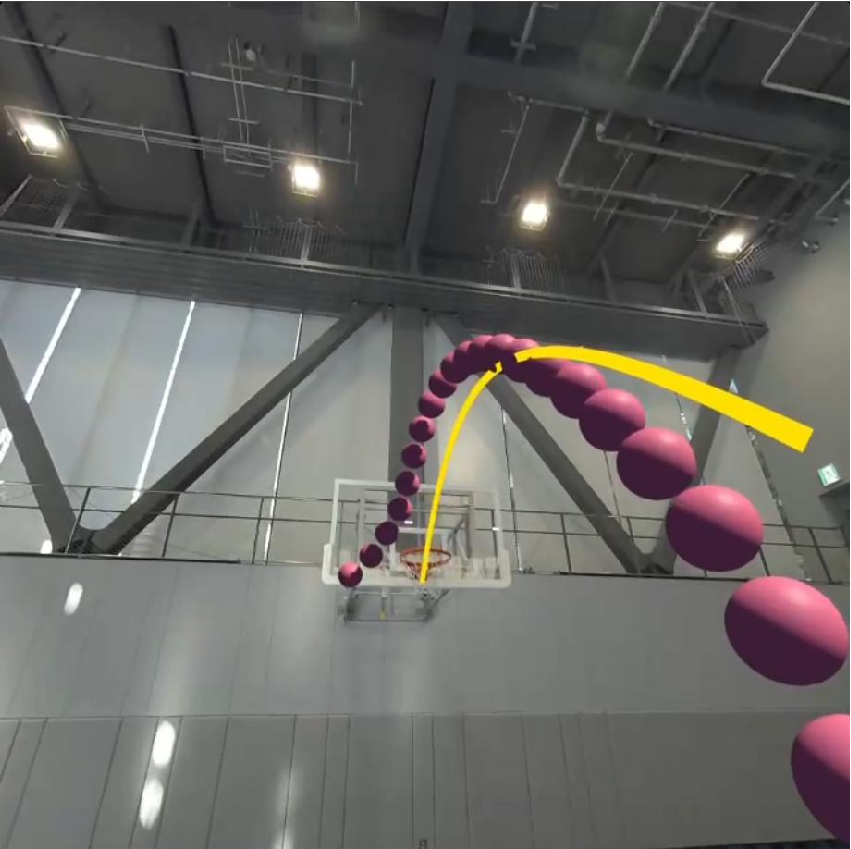
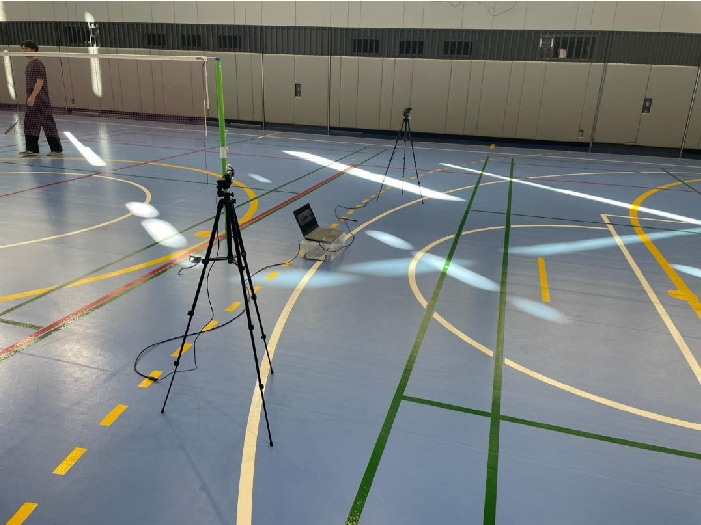
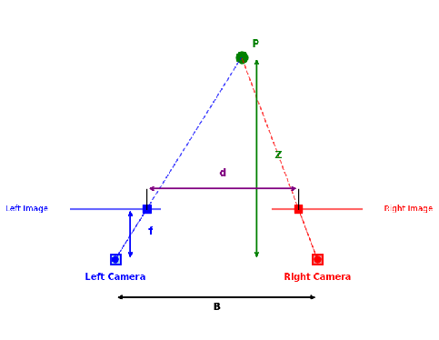
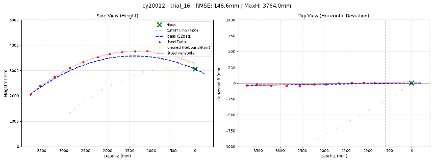

# basketExperiment-3D

バスケットボールのシュート軌跡をステレオカメラで三次元計測し、MRヘッドセット（Meta Quest 3）上に残像として可視化するためのシステムです。



## 概要

本システムは以下の3つの機能で構成されています。

1. **ステレオカメラによるボールの三次元位置推定** — 2台のWebカメラとYOLOによるボール検出、三角測量による3D座標算出
2. **実験管理GUI** — 被験者情報の管理、録画、キャリブレーション、MATLAB連携を統合したGUIアプリケーション
3. **三次元軌跡の可視化** — 計測結果のインタラクティブな3Dグラフ表示

### カメラ配置



2台のWebカメラをステレオ配置し、ArUcoマーカーを基準としたワールド座標系を定義します。

### 三角測量による3D位置推定



左右カメラの画像上でYOLOにより検出されたボール位置から、三角測量によって三次元座標を算出します。

### 計測結果の可視化



計測されたシュート軌跡を、理想軌道との比較を含むインタラクティブな3Dグラフとして描画できます。

## フォルダ構成

```
basketExperiment-3D/
├── experiment_gui_matlab_bridge.py   # メインGUI（実験管理・録画・MATLAB連携）
├── capture_calibration_images.py     # ステレオカメラのキャリブレーション画像撮影
├── reprocess_data_auto.py            # 録画済みデータの再解析スクリプト
├── visualize_3d_result.py            # 3D軌跡のインタラクティブ可視化
├── yolo_loader.py                    # YOLOモデルのラッパー（MATLABから呼び出し）
├── calibration_settings.yaml         # カメラデバイス・解像度・FPS等の設定
├── matlab/
│   ├── calibrate_from_backboard.m    # バックボード4点法によるキャリブレーション
│   ├── detect_aruco_pose.m           # ArUcoマーカーの姿勢推定
│   └── run_tracking_func.m           # YOLO検出＋三角測量による3D追跡
├── models/
│   ├── best.pt                       # YOLOv8 学習済みモデル
│   └── best-yolo11n.pt              # YOLOv11n 学習済みモデル
├── params/
│   ├── stereoParams.mat              # ステレオカメラキャリブレーションパラメータ
│   └── marker_pose.mat               # ArUcoマーカー姿勢データ
├── core/
│   ├── experiment_config.py          # 実験設定・定数・パス管理
│   └── data_manager.py              # 実験データの保存・読み込み管理
├── utils_modules/
│   ├── utils.py                      # カメラパラメータ読み込みユーティリティ
│   └── plot_widget.py               # 軌跡プロット表示ウィジェット
├── docs/                             # 技術ドキュメント・研究資料
└── images/                           # 研究用画像
```

## 必要環境

- **Python 3.x**
  - OpenCV, NumPy, pandas, matplotlib, ultralytics (YOLO), PyYAML, Pillow
- **MATLAB** （MATLAB Engine API for Python が必要）
  - Computer Vision Toolbox（ArUco検出・ステレオ処理）
- **ハードウェア**
  - Webカメラ 2台（ステレオ配置）
  - ArUcoマーカー（DICT_4X4_50, ID=0, 550mm）

## 使い方

### 1. カメラキャリブレーション

`calibration_settings.yaml` でカメラデバイスIDと解像度を設定した後、キャリブレーション画像を撮影します。

```bash
python capture_calibration_images.py
```

撮影した画像を MATLAB の `stereoCameraCalibrator` でキャリブレーションし、`params/stereoParams.mat` に保存します。

### 2. 実験の実施

メインGUIを起動して、被験者登録・録画・キャリブレーション・3D追跡を一連の操作で行います。

```bash
python experiment_gui_matlab_bridge.py
```

GUI上では以下の操作が可能です：
- 被験者IDの登録と管理
- ステレオカメラによる同期録画
- バックボード4点法 / ArUco PnP法によるキャリブレーション
- 録画直後の自動3Dトラッキング

### 3. データの再処理

録画済みデータを後から再解析する場合に使用します。`reprocess_data_auto.py` 内のパラメータ（被験者ID、試行番号、キャリブレーション方式）を編集して実行します。

```bash
python reprocess_data_auto.py
```

### 4. 結果の可視化

生成されたCSVファイルを3Dグラフとして表示します。`visualize_3d_result.py` 内の `CSV_FILE` パスを編集して実行します。

```bash
python visualize_3d_result.py
```

バックボード、リング、フリースローラインなどのコート要素と共に、ボール軌跡をインタラクティブに確認できます。
